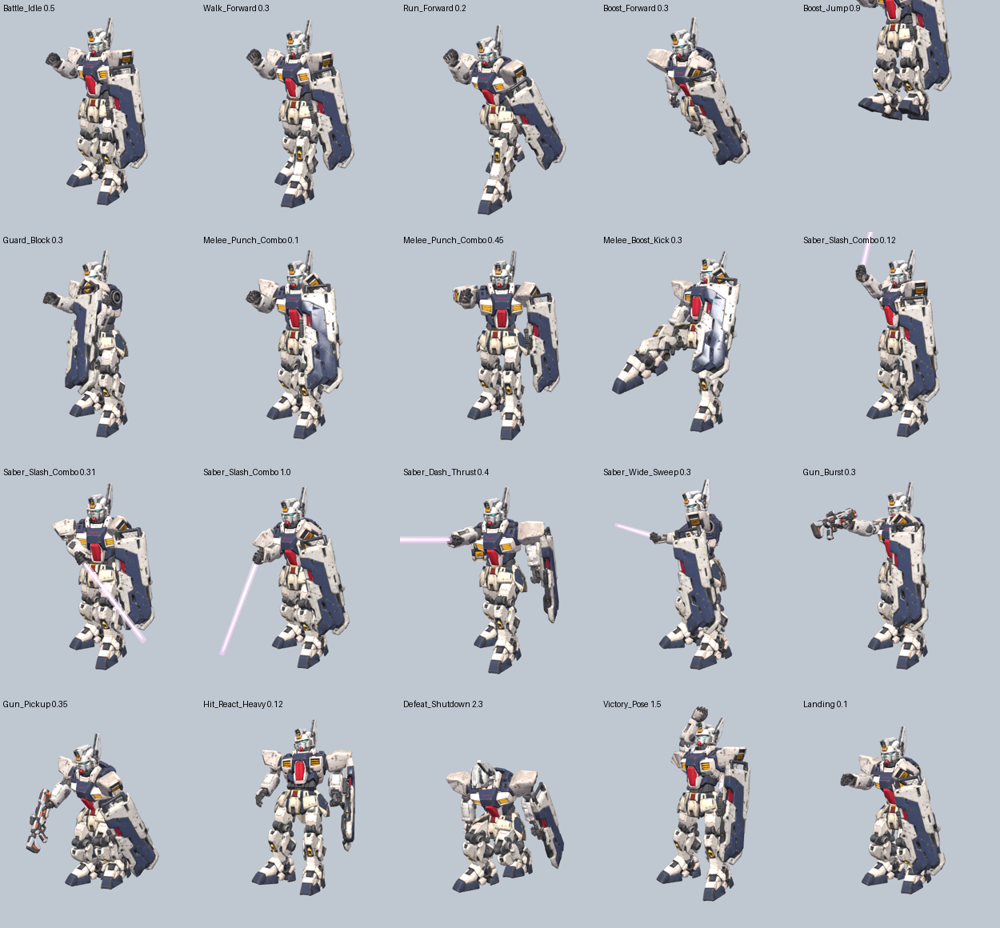
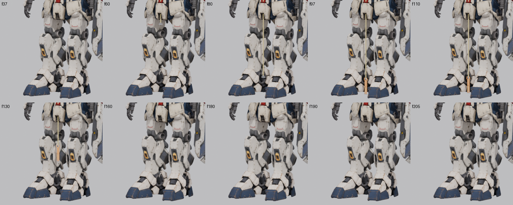

# Mech rig

Rigged version of `mech-build-01.fbx` (3ds Max export), built for PlayCanvas.


| File | Use |
| --- | --- |
| `mech_rigged.glb` | Upload this to the PlayCanvas Editor (or load with `pc.Asset` type `container`). |
| `mech_rigged.fbx` | Same rig and clips, if you want to edit in 3ds Max/Blender. |
| `rig_mech.py` | Script that builds the rig from the original FBX (Blender 4.2 / `bpy`); picks up the shield from `../shield/` (or `MECH_SHIELD`). |

## What's in it

- One skinned mesh (`MechBody`, 39k verts, 8 materials, textures embedded),
  including the shield from `../shield/shield_lowpoly.glb` mounted on the
  outside of the left forearm (bound to `ForeArm_L`).
- `_L` / `_R` are the mech's own left and right (left = +X in glTF, on the
  viewer's right when it faces you).
- 58 bones (23 body + 14 finger bones per hand + saber, gun and vulcan sockets), Y-up, model faces **+Z**,
  about 2.8 units tall:

  ```
  Root
  └─ Hips ─┬─ Spine ─┬─ Head
           │         ├─ Shoulder_L ─ UpperArm_L ─ ForeArm_L ─ Hand_L ─ fingers
           │         └─ Shoulder_R ─ UpperArm_R ─ ForeArm_R ─ Hand_R ─ fingers
           ├─ UpperLeg_L ─ LowerLeg_L ─ Foot_L   (same for _R)
           └─ SkirtFront_L/R, SkirtSide_L/R, SkirtBack
  ```

- Fingers under each `Hand_*`: `Thumb1-3`, `Index1-3`, `Middle1-3`,
  `Ring1-2` (the model's ring finger has two segments) and `Pinky1-3`, each
  with a `_L`/`_R` suffix. Rotating a finger bone on its local X curls it
  toward the palm.
- In both clips the left hand grips the shield's handle (wrist locked, fist
  closed, a slight squeeze on each step); the right hand hangs in a loose curl
  that flexes with the arm swing.
- Hard-surface binding: every armor part follows exactly one bone at weight
  1.0, so nothing bends or stretches.
- Animation clips (30 fps, in place): the game's 52 move names, in the game's order and
  lengths, hand-animated for this mech (`moves_spec.py`), plus two extras. Attack
  clips hit inside the game's damage windows. The shield arm uses poses solved from
  the shield geometry, so the shield always stays upright with its face out.

  | # | Clip | # | Clip | # | Clip |
  | --- | --- | --- | --- | --- | --- |
  | 1 | Joint_Check | 19 | Saber_Slash_Combo | 37 | Turn_R_45 |
  | 2 | Idle (**ours**) | 20 | Saber_Dash_Thrust | 38 | Saber_Run_Slash |
  | 3 | Battle_Idle | 21 | Saber_Air_Slash | 39 | Saber_Boost_Slash |
  | 4 | Boost_Forward | 22 | Saber_Sheathe (**ours**) | 40 | Boost_Hop_Back |
  | 5 | Boost_Dash_Burst | 23 | Melee_Punch_Combo | 41 | Boost_Hop_L |
  | 6 | Boost_Back | 24 | Melee_Boost_Kick | 42 | Boost_Hop_R |
  | 7 | Boost_Strafe_L | 25 | Guard_Block | 43 | Saber_Rising_Slash |
  | 8 | Boost_Strafe_R | 26 | Guard_Block_Hit | 44 | Saber_Wide_Sweep |
  | 9 | QuickStep_L | 27 | Hit_React_Light | 45 | Saber_Stab_Combo |
  | 10 | QuickStep_R | 28 | Hit_React_Heavy | 46 | Saber_Cross_Cut |
  | 11 | Boost_Jump | 29 | Victory_Pose | 47 | Saber_Parry_Riposte |
  | 12 | Air_Hover | 30 | Defeat_Shutdown | 48 | Gun_Idle |
  | 13 | Landing | 31 | Walk_Forward | 49 | Gun_Pickup |
  | 14 | Head_Vulcan_Fire | 32 | Walk_Back | 50 | Gun_Burst |
  | 15 | Head_Vulcan_Sweep | 33 | Walk_Strafe_L | 51 | Gun_Charge |
  | 16 | Air_Vulcan_Fire | 34 | Walk_Strafe_R | 52 | Gun_Charge_Shot |
  | 17 | Saber_Draw (**ours**) | 35 | Run_Forward | 53 | Walk (**ours**, extra) |
  | 18 | Saber_Idle (**ours**) | 36 | Turn_L_45 | 54 | Saber_Walk (**ours**, extra) |



## Weapons and sockets

- `Gun` (right hand) carries `../gun/gun.glb`; it is hidden (scale 0.001) in every clip
  except the `Gun_*` ones. `Gun_Muzzle` marks the barrel tip for shot effects.
- `Vulcan_L` / `Vulcan_R` on the head mark the head-vulcan muzzles for the
  `Head_Vulcan_*` / `Air_Vulcan_Fire` effects.

## Beam saber


- The hilt is stored upright on the front edge of the shield's back, sunk 1.5 cm into
  it; its grip uses the grey sampled from the shield's back side. Its `Saber` bone is a child of
  `ForeArm_L`, so in the plain clips it rides along with the shield.
- `SaberBlade` scales the blade: 0.001 = off (collapsed into the emitter), 1 = lit.
  The blade is a white emissive core plus a translucent pink glow shell.
- `SaberGrip` is a socket inside the right fist (child of `Hand_R`) if you want to
  attach other props there at runtime.
- In the draw, the right arm pose at the grab is solved so the fist lands exactly on
  the stored hilt; from that frame the saber follows the hand. Everything is baked to
  plain keyframes, so no constraints are needed in PlayCanvas.

Cleanup done on the source: 9 duplicate parts that were stacked on top of
each other were removed, mirrored parts had their inside-out faces fixed, and
the leg normal map was reconnected.

## PlayCanvas (engine API)

```js
const asset = new pc.Asset('mech', 'container', { url: 'mech_rigged.glb' });
app.assets.add(asset);
asset.ready((a) => {
  const mech = a.resource.instantiateRenderEntity();
  app.root.addChild(mech);
  mech.addComponent('anim', { activate: true });
  const clips = {};
  a.resource.animations.forEach((c) => (clips[c.resource.name] = c.resource));
  mech.anim.assignAnimation('Idle', clips.Idle);
  mech.anim.assignAnimation('Walk', clips.Walk);
  mech.anim.baseLayer.transition('Walk', 0.2); // switch clips with a blend
});
app.assets.load(asset);
```

In the Editor, drop `mech_rigged.glb` into Assets; the import creates a template
plus `Idle` and `Walk` animation assets that you can put in an Anim State Graph.

## Cockpit



- The red chest panel is cut free as the cockpit hatch on the `CockpitDoor` bone, hinged
  along its top edge (it swings up and out).
- `Winch` (scale Y = cable length) and `WinchHook` (the stirrup) lower a cable from the
  hatch sill to the ground. At rest they are hidden inside the closed cockpit.
- `Pilot` carries a simple placeholder pilot (~1.8 m at the mech's scale). At rest the
  pilot sits inside the cockpit; attach your own pilot model to this bone to replace it.
- Clips (after the game list): `Cockpit_Open` (1.2 s), `Cockpit_Close` (1.0 s),
  `Winch_Lower` (2.0 s), `Winch_Raise` (3.0 s: pilot steps on, rides up, steps into the
  cockpit), `Pilot_Board` (8.3 s: open, lower, raise, close in one clip).
