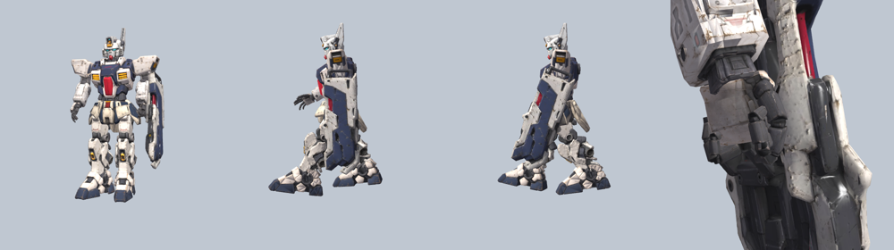
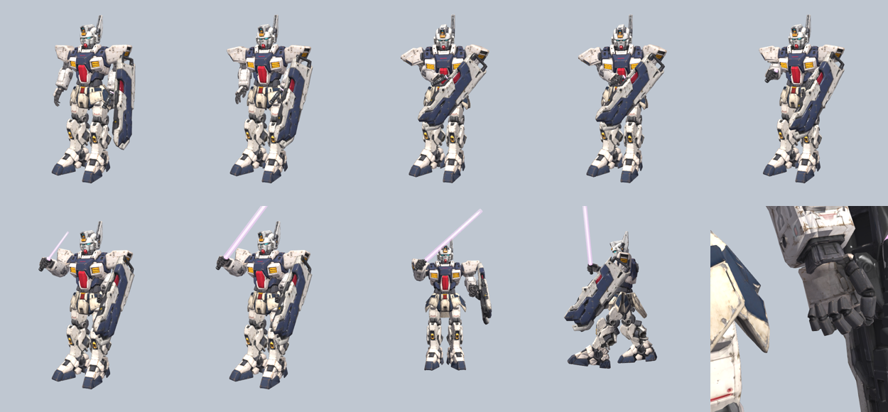

# Mech rig

Rigged version of `mech-build-01.fbx` (3ds Max export), built for PlayCanvas.



| File | Use |
| --- | --- |
| `mech_rigged.glb` | Upload this to the PlayCanvas Editor (or load with `pc.Asset` type `container`). |
| `mech_rigged.fbx` | Same rig and clips, if you want to edit in 3ds Max/Blender. |
| `rig_mech.py` | Script that builds the rig from the original FBX (Blender 4.2 / `bpy`); picks up the shield from `../shield/` (or `MECH_SHIELD`). |

## What's in it

- One skinned mesh (`MechBody`, 39k verts, 8 materials, textures embedded),
  including the shield from `../shield/shield_lowpoly.glb` mounted on the
  outside of the left forearm (bound to `ForeArm_L`).
- `_L` / `_R` are the mech's own left and right (left = +X in glTF, on the
  viewer's right when it faces you).
- 54 bones (23 body + 14 finger bones per hand + 3 saber bones), Y-up, model faces **+Z**,
  about 2.8 units tall:

  ```
  Root
  └─ Hips ─┬─ Spine ─┬─ Head
           │         ├─ Shoulder_L ─ UpperArm_L ─ ForeArm_L ─ Hand_L ─ fingers
           │         └─ Shoulder_R ─ UpperArm_R ─ ForeArm_R ─ Hand_R ─ fingers
           ├─ UpperLeg_L ─ LowerLeg_L ─ Foot_L   (same for _R)
           └─ SkirtFront_L/R, SkirtSide_L/R, SkirtBack
  ```

- Fingers under each `Hand_*`: `Thumb1-3`, `Index1-3`, `Middle1-3`,
  `Ring1-2` (the model's ring finger has two segments) and `Pinky1-3`, each
  with a `_L`/`_R` suffix. Rotating a finger bone on its local X curls it
  toward the palm.
- In both clips the left hand grips the shield's handle (wrist locked, fist
  closed, a slight squeeze on each step); the right hand hangs in a loose curl
  that flexes with the arm swing.
- Hard-surface binding: every armor part follows exactly one bone at weight
  1.0, so nothing bends or stretches.
- Animation clips (30 fps, in place):

  | Clip | Length | Loop | What happens |
  | --- | --- | --- | --- |
  | `Idle` | 2 s | yes | saber stored on the shield, blade off |
  | `Walk` | 1 s | yes | saber stored, blade off |
  | `SaberDraw` | 1.5 s | no | shield swings across, right hand pulls the saber, blade ignites |
  | `SaberIdle` | 2 s | yes | saber held at the ready, blade humming |
  | `SaberWalk` | 1 s | yes | walk with the saber held |
  | `SaberSheathe` | 1.5 s | no | `SaberDraw` in reverse: blade off, saber back on the shield |

  Chain them in an Anim State Graph: `Idle/Walk` → `SaberDraw` → `SaberIdle/SaberWalk`
  → `SaberSheathe` → `Idle/Walk`. Draw/Sheathe should not loop and should use
  exit time 1.0 so the handover frames play fully.

## Beam saber



- The hilt is stored on the shield's inner front edge. Its `Saber` bone is a child of
  `ForeArm_L`, so in the plain clips it rides along with the shield.
- `SaberBlade` scales the blade: 0.001 = off (collapsed into the emitter), 1 = lit.
  The blade is a white emissive core plus a translucent pink glow shell.
- `SaberGrip` is a socket inside the right fist (child of `Hand_R`) if you want to
  attach other props there at runtime.
- In the draw, the right arm pose at the grab is solved so the fist lands exactly on
  the stored hilt; from that frame the saber follows the hand. Everything is baked to
  plain keyframes, so no constraints are needed in PlayCanvas.

Cleanup done on the source: 9 duplicate parts that were stacked on top of
each other were removed, mirrored parts had their inside-out faces fixed, and
the leg normal map was reconnected.

## PlayCanvas (engine API)

```js
const asset = new pc.Asset('mech', 'container', { url: 'mech_rigged.glb' });
app.assets.add(asset);
asset.ready((a) => {
  const mech = a.resource.instantiateRenderEntity();
  app.root.addChild(mech);
  mech.addComponent('anim', { activate: true });
  const clips = {};
  a.resource.animations.forEach((c) => (clips[c.resource.name] = c.resource));
  mech.anim.assignAnimation('Idle', clips.Idle);
  mech.anim.assignAnimation('Walk', clips.Walk);
  mech.anim.baseLayer.transition('Walk', 0.2); // switch clips with a blend
});
app.assets.load(asset);
```

In the Editor, drop `mech_rigged.glb` into Assets; the import creates a template
plus `Idle` and `Walk` animation assets that you can put in an Anim State Graph.
